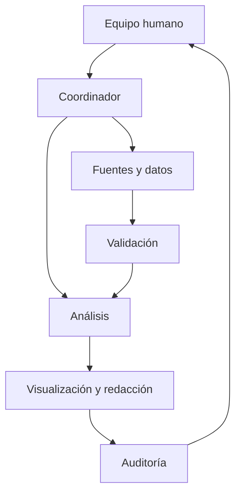

# Arquitectura multiagéntica

El equipo humano define el problema y aprueba los puntos de control. El coordinador ejecuta las dependencias registradas en `config/tasks.yaml`. Ningún agente reemplaza la responsabilidad académica del grupo.

## Subagentes

- Fuentes nacionales: INEC, BCE, MEF y otras instituciones ecuatorianas.
- Fuentes internacionales: Banco Mundial, FMI, CEPAL, OIT y organismos comparables.
- Literatura: artículos y documentos técnicos.
- Limpieza: transformaciones reproducibles.
- Gráficos: preparación de visualizaciones.
- Referencias: verificación bibliográfica.
